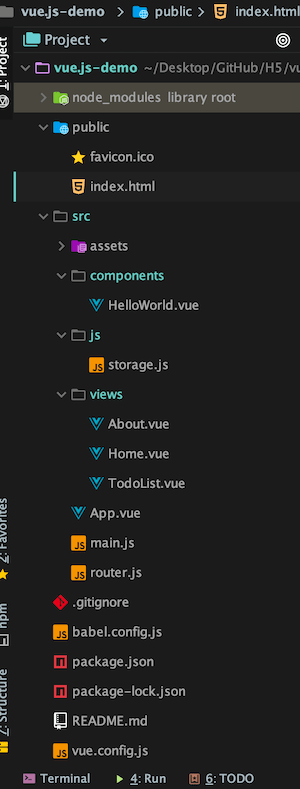

# vue.js-demo

### 安装

#### 安装 Node.js

前往 `https://nodejs.org/en/` 下载安装

#### NPM 安装 Vue
NPM 是 Node.js 包管理工具，类似 iOS CocoaPods。

```bash
# 最新稳定版
$ npm install vue
```

项目中要添加其他依赖的第三方库，也可以用 npm 添加，编辑好 `package.json` 后执行 `npm install`。通过 `WebStorm` 创建一个 Vue.js 项目在最后也是安装依赖。

#### Vue CLI 安装

Vue CLI 是一个基于 Vue.js 进行快速开发的完整系统，类似 CocoaPods 的 `pod lib create Project`，用于构建一个标准的 Vue 项目。

```bash
npm install -g @vue/cli
```

如果报错 
`Error: EACCES: permission denied, access '/usr/local/lib/node_modules`

使用命令
```bash
sudo npm install -g @vue/cli
```


### Vue 模板项目解析

通过 `WebStorm` 创建一个 `Vue.js` 项目，目录结构如下，其中 `TodoList.vue` 和 `storage.js` 是我写的，不在模板范围内




#### 目录结构说明：

##### node_modules library root

通过 `npm install` 安装的依赖的库

##### public/index.html

项目入口

```html
<body>
    <div id="app"></div>
    <!-- built files will be auto injected -->
</body>
```

`index.html` 会默认调用 `src/main.js`，里面声明了上面 `<div id="app"></div>` 的组件

##### src/main.js

```js
new Vue({
  router,
  render: h => h(App)
}).$mount('#app');
```
声明了一个 Vue 对象接管 id="app" 的元素，实现元素和 Vue 对象的绑定。id="app" 的元素称为 Vue 实例的`挂载点`。`render` 和 `templete` 功能类似，都是声明一个模块，但是效率高，具体原理现在看的不是很懂，以后想到再补充。
该 Vue 对象的模板写在 `src/App.Vue` 中

##### src/App.Vue

声明了一个模板

```html
<template>
  <div id="app">
    <div id="nav">
      <router-link to="/">Home</router-link> |
      <router-link to="/about">About</router-link> |
    </div>
    <router-view/>
  </div>
</template>

<style>
/* ... */
</style>

```

`<router-view/>` 表示从路由文件 `src/router.js` 中获取指定的组件加入

##### src/router/index.js

```js
export default new Router({
  routes: [
    {
      path: '/',
      name: 'home',
      component: Home
    }
  ]
})
```

执行的是一个路由功能，会把一个 path 为 '/' 的 url 跳转到 view `Home`，该组件的路径为 `src/view/Home.vue`，因此起始运行项目后打开的首页是组件 `Home`

##### src/view/Home.vue

```js
<template>
  <div class="home">
    
    <HelloWorld msg="Welcome to Your Vue.js App"/>
  </div>
</template>

<script>
// @ is an alias to /src
import HelloWorld from '@/components/HelloWorld.vue'

export default {
  name: 'home',
  components: {
    HelloWorld
  }
}
</script>
```

`export default` 导出了一个匿名对象，因此可以在 `src/router.js` 中通过 `import Home from './views/Home.vue'` 导入这个对象。[export介绍](https://developer.mozilla.org/zh-CN/docs/Web/JavaScript/Reference/Statements/export)

`Home.vue` 又使用了模板 `HelloWorld`，并且通过 `HelloWorld` 的 props 属性给他传递参数

### 注意事项

#### 1.data 是一个 function，methods 是一个 object
```js
export default {
    name: "TodoList",
    data() {
        return {
            
        }
    },
    methods: {
          
    }
}
```

#### 2. watch 中 deep 属性作用

```js
watch: {
    items: {
        handler: function () {
              
        },
        deep: true
    }
}
```
上面代码观察 items 变化后执行 handler
items 若为一个数组，那么改变其中一个索引的值，deep 为 true 时是可以观察到的，反之无法观察到。